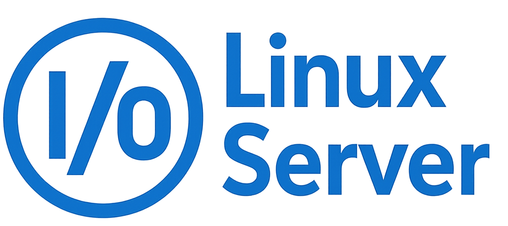

# I/O Linux Server

**I/O Linux Server** is a modern dashboard for managing your Linux system using native tools.  
It aims to unify essential functionality in a single web-based interface without reinventing the wheel.  

## 🧠 Philosophy

Most Linux distributions already come with powerful tools for monitoring and control—`top`, `systemctl`, `ss`, etc.  
This project is about **leveraging those existing tools** by exposing their input/output via a friendly, minimal, and customizable web UI.  

Instead of replacing the Linux experience, **IO Linux Server visualizes it.**  

## ⚙️ Stack

- **Frontend:** React + Vite + MUI (based on Mira Pro theme by Bootlab - https://mira.bootlab.io/)  
- **Backend:** Go + Gin + gorilla  

## 🚀 Features

- 🖥️ System stats dashboard (CPU, memory, disk, network)  
- 🧠 Process viewer  
- 💻 Live terminal output from standard Linux commands  
- 🔐 Login/authentication (via PAM or pluggable systems)  
- 🧱 Serve React frontend statically in production  
- 🛡️ Wireguard management  
- 🐳 Docker Manager (via docker compose)

## 📦 Getting Started

Clone the repo:

git clone https://github.com/mordilloSan/IO-Linux-Server  
cd IO-Linux-Server

Install dependencies:

# Update package list
sudo apt update

# Install required tools
sudo apt install make lm-sensors

sudo apt install libpam0g-dev (for Debian based distros)  
sudo dnf install pam-devel (for RHEL based distros)

🛠️  Available commands:

make setup            Install frontend deps and Node.js (22)  
make dev              Start frontend (Vite) and backend (Go) in dev mode  
make test             Run frontend lint + type checks  
make build            Run full build (frontend + backend)  
make build-frontend   Build React app using Vite  
make build-backend    Compile Go backend with version metadata  
make prod             Run production backend  
make clean            Remove build artifacts  
make check-env        Verify .env and required variables 
make help             This help menu  

✅ Both "make dev" and "make prod" will run all necessary setup automatically.

## 📦 Logging In

This project uses PAM authenthication to login directly to your linux system via your own username and password

## 📁 Project Structure

IO_Linux_Server/  
├── go-backend/       # Gin-powered backend  
├── react/            # Vite + React frontend  
├── .env              # Environment variables  
├── makefile          # Automation of builds & setup  
└── README.md         # You're reading it!  

## 📃 License

MIT License — feel free to use, fork, or contribute!

## 🙋‍♂️ Author

Created by @mordilloSan - miguelgalizamariz@gmail.com  
Pull requests and feedback are always welcome!
